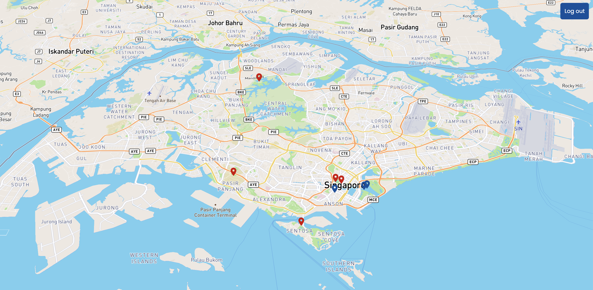
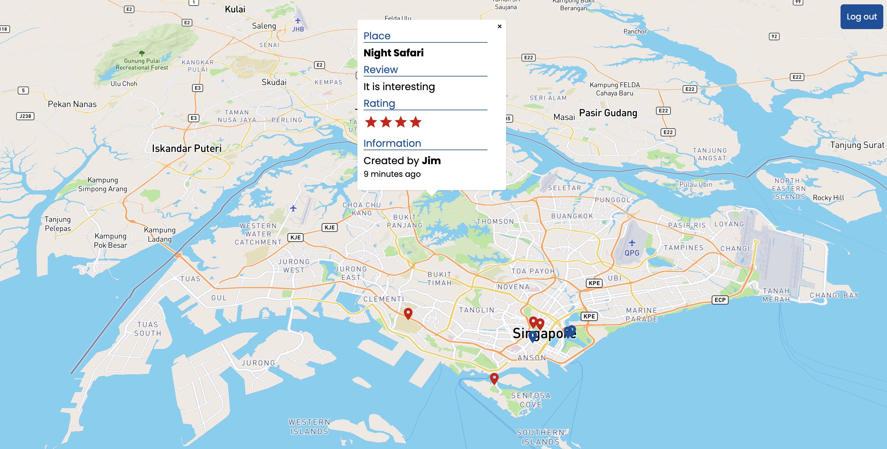
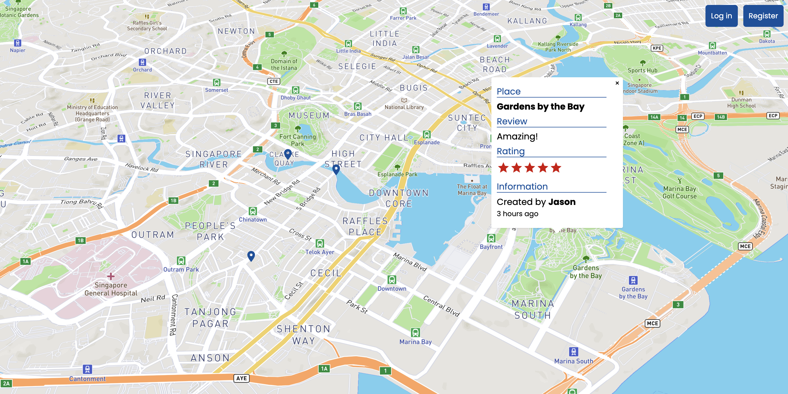
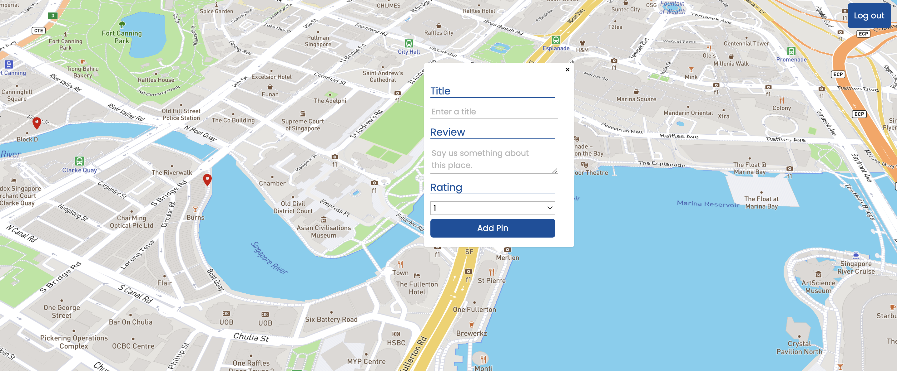

# Mapin

## About The Project

### Mapin is the App that allows users to share their favorite places with others.



## Built with

- [React.js](https://reactjs.org/)
- [Express.js](https://expressjs.com/)
- [MongoDB](https://www.mongodb.com/)
- [Node.js](https://nodejs.org/en/)
- [Mapbox](https://www.mapbox.com/)


## Demo

### When you click the pin, you can see the place's name, description, rating, and the user who shared it.


### The blue pins represent the places that other users have shared. The red pin represents the place that you have shared.


### When you click the map, you can share the place you like.



## Getting Started

### Prerequisites
- npm
```bash
$ npm install npm@latest -g
```

### Installation

```bash
# Clone the repository
$ git clone git@github.com:wctseng99/Mapin.git && cd Mapin
# Install NPM packages
$ npm install
# Create .env file in frontend folder and and enter your Mapbox API key.
$ REACT_APP_MAPBOX = your_mapbox_api_key
# Create .env file in backend folder and and enter your MongoDB API key.
$ MONGODB_URI = your_mongodb_uri
```

### Usage
```bash
# Run the app
$ npm start
```
