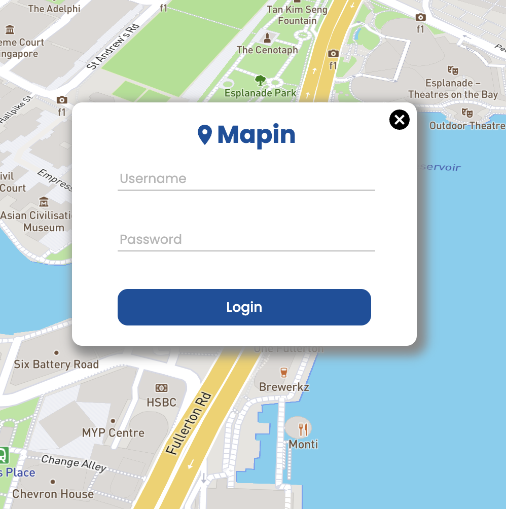

## About The Project

### Mapin is the App that allows users to share their favorite places with others.


## Built with

- [React.js](https://reactjs.org/)
- [Express.js](https://expressjs.com/)
- [MongoDB](https://www.mongodb.com/)
- [Node.js](https://nodejs.org/en/)
- [Mapbox](https://www.mapbox.com/)
  
[](https://skillicons.dev)

## Demo
#### Register to create an account.


#### Login to your account.


#### When you click the pin, you can see the place's name, description, rating, and the user who shared it.


#### The blue pins represent the places that other users have shared. The red pin represents the place that you have shared.


#### When you click the map, you can share the place you like.


## Getting Started

### Prerequisites
- npm
```bash
$ npm install npm@latest -g
```

### Installation

```bash
# Clone the repository
$ git clone git@github.com:wctseng99/Mapin.git && cd Mapin

# Install NPM packages in both frontend and backend folders
$ cd frontend && npm install
$ cd ../backend && npm install

# Create .env file in frontend folder and enter your Mapbox API key.
$ echo "REACT_APP_MAPBOX=your_mapbox_api_key" > frontend/.env

# Create .env file in backend folder and enter your MongoDB API key and database connection URI.
$ echo "MONGODB_URI=your_mongodb_uri" > backend/.env

```

### Usage
```bash
# Run the app
$ cd frontend ;npm start
$ cd backend ;npm start
```
